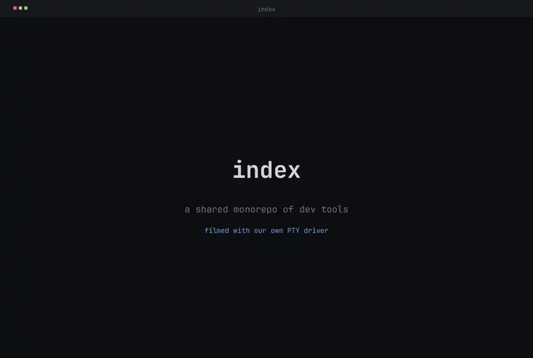

<p align="center">
  
</p>

<p align="center">
  <a href="https://antithesis.com/"></a>
  <!-- OpenSSF Scorecard badge hidden until the rolling Code-Review score
       and CII Best Practices badge catch up; surface it once both move. -->
  <!-- <a href="https://scorecard.dev/viewer/?uri=github.com/indexable-inc/index"></a> -->
</p>

<p align="center">
  <picture>
    <source media="(prefers-color-scheme: dark)"  srcset="docs/demo-dark.avif"  type="image/avif">
    <source media="(prefers-color-scheme: light)" srcset="docs/demo-light.avif" type="image/avif">
    <source media="(prefers-color-scheme: dark)"  srcset="docs/demo-dark.webp">
    <source media="(prefers-color-scheme: light)" srcset="docs/demo-light.webp">
    
  </picture>
</p>

<p align="center">
  <a href="https://ix.dev">ix.dev</a>
</p>

# Index

`index` is a shared, open-source monorepo of developer tools that anyone can
modify. The bet: one repo everyone can edit is the fastest way for all of us to
move. Add something useful, and everyone gets it.

It is one Nix flake holding ~45 packages (mostly Rust, with Python, Elixir,
TypeScript, and Svelte where they fit), a corpus of NixOS modules and OCI
images, and the agent infrastructure that ties them together. Most packages
have a from-source page under [`docs/`](docs/index.md); start there to go deep
on any one of them.

To explore, you could point Claude at this repo and ask whether anything here is
useful for you.

## What's inside

### Agent infrastructure ([`packages/agent`](packages/agent/))

The harness, governance, and tuning loop that runs coding agents (Claude Code
and Codex) across the fleet under one set of rules.

- **The system prompt is Nix, not a text file.** [`system-prompt.nix`](packages/agent/system-prompt.nix)
  encodes the house prompt as an ordered set of named, reviewable bindings, so
  behavior changes land as PR diffs. [`common.nix`](packages/agent/common.nix)
  shares the prompt and MCP server list across both [`claude-code`](packages/agent/claude-code/)
  and [`codex`](packages/agent/codex/) wrappers; [`policy`](packages/agent/policy/)
  centralizes tool-access rules (deny force-merge, block builtins superseded by
  MCP servers) for both.
- **Measured, not vibes.** [`system-prompt-eval`](packages/agent/system-prompt-eval/)
  spawns fresh, sandboxed `claude -p` rollouts, scores them with an LLM judge,
  and commits the scores so prompt edits are validated against past behavior
  before they ship.
- **Hooks as one compiled binary.** [`claude-hooks`](docs/claude-hooks/overview.md)
  replaces hand-rolled shell hooks with a single Rust binary of lifecycle
  subcommands (worktree guards, transcript digesting, friction reporting). Every
  hook fails open and silent: a broken hook never blocks a session.
- **[`subagent-cache`](packages/agent/subagent-cache/)** memoizes expensive
  read-only investigations across the team with a three-stage validation pipeline
  (Postgres full-text recall, a Haiku judge, then client-side file-freshness
  hashing) so a cached finding is only reused while it is still true.
- **[`symphony`](packages/agent/symphony/)** is an Elixir/OTP runtime that
  orchestrates multi-repo Codex sessions from workflows written in a `.sym` DSL,
  each session isolated in its own git worktree, with a LiveView dashboard and
  Slack/Linear/GitHub/cron triggers.
- **[`distiller`](packages/agent/distiller/)** turns raw session transcripts into
  searchable, reusable lessons, **[`pi-harnesses`](packages/agent/pi-harnesses/)**
  packages fixed agent postures (sandboxed engine, beam-search executor,
  skeptical prosecutor), and **[`claude-stories`](packages/agent/claude-stories/)**
  puts an Instagram-style row of teammate avatars in the status line, peer-discovered
  over Tailscale with no central server.

### A Nix build system rebuilt for speed ([`packages/nix`](packages/nix/))

- **[`nix-cargo-unit`](packages/nix/nix-cargo-unit/)** renders the Cargo
  workspace as one content-addressed Nix derivation *per rustc compilation unit*
  instead of per crate, giving fine-grained incremental Rust builds across the repo.
- **[`snix`](packages/nix/snix/)** is a Rust reimplementation of Nix, built here
  with cargo-unit: ~1100 individual crate builds collapse into unified incremental
  compilation.
- **[`nix-fast-build`](packages/nix/nix-fast-build/)** + [`nix-eval-jobs`](packages/nix/nix-eval-jobs/)
  carry patches that correctly skip already-realized floating content-addressed
  outputs, turning an ~85s cache-check floor for ~1450 units into ~0.1s.
- **[`oci-image-builder`](packages/nix/oci-image-builder/)** splits image
  "describe" from "materialize" and shards per-layer tarring into separate
  derivations, so incremental image rebuilds stay fast and deterministic.
- **[`nix-web-monitor`](packages/nix/nix-web-monitor/)** streams Nix's internal
  JSON build log into a live browser dashboard (Rust server, Svelte UI) while the
  build runs in your terminal.

Around these, [`blast-radius`](packages/blast-radius/) reports how many
derivations a PR would rebuild and why, and [`indexbench`](packages/indexbench/)
gates macro-benchmark and allocation-count regressions in CI.

### Code intelligence and search

- **[Semantic code search](packages/search/search/)** finds code by meaning, not
  exact strings. The core is content-addressed: files are keyed by content hash,
  so identical files across branches and repos share one embedding, and a local
  manifest keeps results scoped to your tree. Python bindings ship it into agent kernels.
- **[`astlog`](packages/code/astlog/)** runs Datalog over tree-sitter syntax
  trees: a query match becomes a relation, joins become rules, rewrites become
  templates. It gates `nix run .#lint` for both Nix and Rust.
- **[`scipql`](packages/code/scipql/)** lifts the same idea to *semantics*: Soufflé
  Datalog over a SCIP index, so `net::Socket` and `mock::Socket` are distinct
  identities and a rename never touches an unrelated same-named symbol.

### Terminal automation ([`packages/tui`](packages/tui/))

- **A [PTY driver](packages/tui/tui/)** lets code drive any interactive terminal
  program (gdb, vim, REPLs) like a human typing into it. Each child gets a real
  pseudo-terminal; output runs through a vt100 emulator so you read back a
  rendered screen (viewport, scrollback, per-cell styling), not raw escape codes.
  Python and Node bindings included.
- **The demo at the top of this README is not a screen recording.** It is
  generated by [`reel`](packages/tui/reel/), which drives a real shell through the
  PTY driver, rasterizes the styled grid with a flat palette and an embedded
  monospace face, and encodes a 60fps animated AVIF (WebP fallback). AV1's
  inter-frame compression keeps it around 140 KB. Regenerate it any time:
  ```sh
  nix run .#reel          # writes docs/demo-{dark,light}.{avif,webp}
  ```
- **[`run`](packages/tui/run/)** records a command under a terminal session
  (keeping agent logs small), and [`dashboard`](packages/dashboard/) renders a live
  grid of running terminals in the browser over a Loro CRDT and SSE.

### Agent-facing primitives ([`packages/mcp`](packages/mcp/))

A Python [`mcp`](packages/mcp/) server hands all of the above to an LLM with no
install step. Its one general `python_exec` tool runs on a single shared,
persistent IPython kernel: namespace persists across calls, work can run
concurrently or background past the foreground budget, and sessions checkpoint to
disk. Bundled modules expose search, the PTY driver, a `fleet` cluster API (Ray,
Spark, SSH fan-out to Polars frames), browser and screen control, and cloud
integrations (Gmail, Calendar, Linear, Slack) without a pip step.

### VMs, images, and fleet ([`images`](images/), [`modules`](modules/), [`packages/vm`](packages/vm/))

Ready-to-run [OCI images](images/) (agent-ready dev boxes, Minecraft servers,
remote desktops) and reusable, auto-discovered [NixOS modules](modules/) are the
layer [ix](https://ix.dev) publishes on top of its closed-source VM primitives.
[`vmkit`](packages/vm/vmkit/) spawns guests on macOS Virtualization.framework or
Linux libkrun from one binary, [`chrome-vm`](packages/vm/chrome-vm/) runs headless
Chromium inside a real VM, [`ix-fleet`](packages/ix-fleet/) drives declarative
multi-VM rollouts, and the repo's own [`dag-runner`](packages/dag-runner/)
executes JSON task DAGs for parallel health checks.

## Quick check

```sh
nix flake show          # list every package, module, and check
nix run .#lint          # nixfmt, statix, deadnix, astlog (nix + rust)
nix build .#minecraft   # realize one image closure
nix run .#reel          # regenerate the demo above
```

## Layout

- [`packages/`](packages/) repo-owned tools: agent stack, Nix build system, semantic search, PTY driver, MCP server, the `reel` recorder.
- [`images/`](images/) runnable NixOS systems packaged as OCI archives.
- [`modules/`](modules/) opt-in NixOS service modules and profiles, auto-discovered.
- [`lib/`](lib/) shared helper and builder API (Rust workspace graph, `buildUvApplication`, Minecraft/NBT helpers, agent integration).
- [`docs/`](docs/index.md) from-source documentation, one page per package.
- [`examples/`](examples/) standalone consumer fleets.
- [`skills/`](skills/) and [`agents/`](agents/) Claude Code skills and subagent definitions, shipped to agents.
- [`rfcs/`](rfcs/) architecture decision records.

## Feedback

Bug reports and enhancement requests go to [GitHub Issues](https://github.com/indexable-inc/index/issues). Security reports follow [SECURITY.md](SECURITY.md). Code changes land through pull requests against the `main` branch; see [CONTRIBUTING.md](CONTRIBUTING.md) for local setup, coding standards, and commit conventions.

## Contributor notes

See [AGENTS.md](AGENTS.md) and [CONTRIBUTING.md](CONTRIBUTING.md) when you're ready to dig in.
