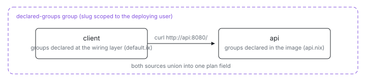

<p align="center">
  <picture>
    <source media="(prefers-color-scheme: dark)" srcset="assets/hero-dark.svg">
    
  </picture>
</p>

# Declared groups

Should a VM's group membership live in the image or in the deployment
wiring? Both work, and this two-VM example shows each source. The `api`
image sets `ix.networking.groups = [ "declared-groups" ]` in its own module,
so anyone deploying that image joins their own `declared-groups` network;
the `client` joins through an inline module added at the composition layer
in [`default.ix`](default.ix), on a group-agnostic image. Both sources
union into the same membership.

## Run

```sh
ix apply .#api .#client
```

The api first: the client's health check curls it over the private group
network. Need the source first?
`git clone https://github.com/indexable-inc/index`, then run it from
`examples/declared/groups`.

## Verify manually

```sh
ix group members declared-groups
ix shell client -- curl -fsS http://api:8080/
```

## Shape

- [`default.ix`](default.ix) declares both VMs; note `api` gets no group
  module.
- [`api.nix`](api.nix) carries the group in the image
  (`ix.networking.groups`) and exposes port 8080 to group members.
- [`client.nix`](client.nix) checks that `http://api:8080/` answers over
  the private network; its membership is the inline module in
  [`default.ix`](default.ix).

## Where the slugs live

Group slugs are scoped to the deploying user (`UNIQUE (owner_id, slug)` on
the server), so a common name like `declared-groups` in a published image
never collides with another user's group of the same name. Slugs are
`[a-z0-9_-]`, max 63 chars (the DNS label limit); the eval rejects
anything else before any RPC runs.
