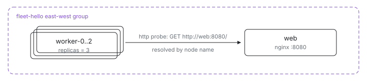

<p align="center"></p>

# Fleet hello

What does a Kubernetes Service plus a three-replica Deployment look like as
one Nix file? This is the smallest multi-node fleet: one `web` node serving a
static page and three `worker` replicas that resolve it by name with
`ix.endpointOf nodes.web "http"` and probe it as their health check — an
`httpGet`-style probe declared as `http = { host; port; }`, no hand-written
curl. Workers roll with `updateStrategy.maxUnavailable = 1`, so `ix up`
updates one replica at a time and each must pass its checks before the next
is touched.

## Run

```sh
cd examples/fleet/hello
ix up
```

Need the repo first? `git clone https://github.com/indexable-inc/index`.

## Shape

- [`ix.nix`](ix.nix) defines the fleet: one `web` node and a `worker` node
  with `replicas = 3` and `updateStrategy.maxUnavailable = 1`, all in one
  east-west group, with `dependsOn` so the web node boots first.
- [`web.nix`](web.nix) runs nginx and declares `ix.networking.expose.http`,
  which opens the firewall, registers the port claim, and names the endpoint
  workers resolve. Its readiness is a one-line `http.port` probe.
- [`worker.nix`](worker.nix) resolves that endpoint and probes it with
  `http = { host = web.host; port = web.port; }` — the platform derives the
  curl command and keeps the probe binary in the image.

## Verify

```sh
# kubectl-get for the fleet: one row per node with STATUS, READY (checks
# passed/total), and ADDRESS; add -o wide for region and running vs desired
# image, --watch to poll, -o json for machines.
ix ls

ix shell worker-0 -- curl --fail http://web:8080/
```

Replicas are numbered `worker-0` through `worker-2`; each reaches `web` by
its node name over the east-west network. `ix logs web --unit nginx` pulls
the nginx journal from the web node.

## Scale

Worker count is one line: raise `worker.replicas` in [`ix.nix`](ix.nix).
Nothing else changes; new replicas join the group and pick up the same
health check.
