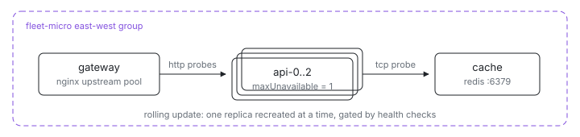

<p align="center">
  <picture>
    <source media="(prefers-color-scheme: dark)" srcset="assets/hero-dark.svg">
    
  </picture>
</p>

# Fleet microservices

A three-tier service — edge proxy, replicated stateless API, shared cache —
as four short Nix files. The pieces you would reach to Kubernetes for are all
here, declared next to the software they describe:

| You'd use in Kubernetes           | Here                                                    |
| --------------------------------- | ------------------------------------------------------- |
| Deployment with `replicas: 3`     | `api.replicas = 3` in [`ix.nix`](ix.nix)                |
| RollingUpdate `maxUnavailable: 1` | `api.updateStrategy.maxUnavailable = 1`                 |
| Service discovery / DNS           | `ix.endpointOf nodes.cache "redis"` by node name        |
| `httpGet` readiness probe         | `ix.healthChecks.ready.http = { port; path; }`          |
| `tcpSocket` probe                 | `ix.healthChecks.cache-reachable.tcp = { host; port; }` |
| `kubectl get pods` / describe     | `nix run .#fleet-microservices-status`                  |
| `kubectl logs`                    | `nix run .#fleet-microservices-logs`                    |
| Ingress / LoadBalancer            | the `gateway` node's nginx upstream pool                |

Unlike a Kubernetes manifest (or a Nomad job), the fleet definition *is* the
machine definition: the same file that sets the replica count also configures
nginx, and the gateway enumerates the api replicas at eval time — raise
`replicas` and the upstream pool and per-replica probes grow to match, before
anything deploys.

## Run

```sh
# From the index repo root.
nix run .#fleet-microservices-up
```

Need the repo first? `git clone https://github.com/indexable-inc/index`.

`up` walks the dependency order (`cache`, then `api-0..2`, then `gateway`)
and, because of `updateStrategy.maxUnavailable = 1`, recreates api replicas
one at a time on later runs: each replica must pass every health check —
nginx up, readiness route answering, cache reachable — before the next one
is touched, so a broken image halts the rollout with two replicas still
serving traffic.

## Shape

- [`ix.nix`](ix.nix) — the fleet: `cache`, `api` with `replicas = 3` and a
  rolling `updateStrategy`, and `gateway`, wired with `dependsOn`.
- [`cache.nix`](cache.nix) — redis, exposed to the group as `redis`, probed
  with a one-line `tcp.port` check.
- [`api.nix`](api.nix) — nginx standing in for a real service; each replica
  reports its own node name. Declares an `http` readiness probe on
  `/healthz` and a cross-node `tcp` probe that the cache is reachable.
- [`gateway.nix`](gateway.nix) — nginx upstream pool built by discovering
  every `api-*` node at eval time, plus one generated `http` probe per
  replica, so fleet health names the exact replica the gateway cannot reach.

## Verify

```sh
# kubectl-get for the fleet: one row per node with STATUS, READY (checks
# passed/total), and ADDRESS. -o wide adds region and running vs desired
# image; --watch polls; -o json feeds scripts and dashboards.
nix run .#fleet-microservices-status
nix run .#fleet-microservices-status -- -o wide

# Round-robin through the replicas via the gateway:
ix shell gateway -- curl --silent http://127.0.0.1:8080/  # {"service":"api","node":"api-1"}

# Journals, kubectl-logs style; without --on it streams every node.
nix run .#fleet-microservices-logs -- --on cache --unit redis-cache --lines 50
```

Every health check is also a standing claim: `nix run
.#fleet-microservices-health` re-runs all of them on demand, and `status`
shows per-node READY as checks-passed/total.

## Scale

Raise `api.replicas` in [`ix.nix`](ix.nix). New replicas join the east-west
group, inherit the same probes, appear in the gateway's upstream pool and in
its per-replica checks, and roll under the same `maxUnavailable = 1` window —
one line, and the whole topology follows.
