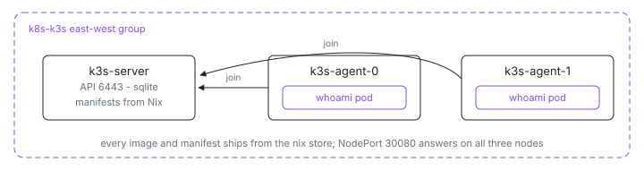

<p align="center">
  <picture>
    <source media="(prefers-color-scheme: dark)" srcset="assets/hero-dark.svg">
    
  </picture>
</p>

# Kubernetes on Nix

A real Kubernetes cluster - one k3s server, two agents - where every layer is
the same language. The machines are NixOS modules, the Deployment and Service
are Nix values that nixpkgs' k3s module renders to YAML, and the pod image is
a `dockerTools` build preloaded into containerd. Nothing pulls from a
registry; the entire cluster, workload included, ships from the nix store.

| Usually                            | Here                                                       |
| ---------------------------------- | ---------------------------------------------------------- |
| kubeadm / cloud control plane      | `services.k3s.enable = true` in [`node.nix`](node.nix)     |
| `kubectl apply -f app.yaml`        | `services.k3s.manifests` in [`workload.nix`](workload.nix) |
| `docker push` + registry pull      | `services.k3s.images` preloads [`image.nix`](image.nix)    |
| airgap image bundles               | `k3s.airgap-images` from the store                         |
| joining nodes with a token by hand | `serverAddr` from the server VM's east-west hostname       |

The VM definition is the cluster definition: [`default.ix`](default.ix)
names the VMs, [`agent.nix`](agent.nix) derives the join address from the
server VM's east-west hostname at eval time, and the Deployment references
the pod image by the exact `imageName:imageTag` of the derivation every node
imports - a drifted tag fails the repo's eval tests before anything boots.

## Run

```sh
ix apply .#k3s-server .#k3s-agent-0 .#k3s-agent-1
```

Need the source first? `git clone https://github.com/indexable-inc/index`
and run it from `examples/k8s/k3s`. Apply order does not matter: agents
retry the join until the API answers, and the server's checks gate success
on every named node reporting Ready, the `whoami` Deployment rolled out,
and its NodePort answering.

## Shape

- [`default.ix`](default.ix) - the VMs: `k3s-server` and two `k3s-agent-*`
  VMs built from one module, one east-west group.
- [`node.nix`](node.nix) - what every cluster node shares: the k3s service,
  the join token, the runtime node-ip handoff, image preload, inter-node
  ports (flannel VXLAN, kubelet), a liveness check.
- [`server.nix`](server.nix) - the control plane: API port, extras disabled,
  the cluster-wide readiness probes (`kubectl wait` over the wired-in VM
  list, rollout status, NodePort http).
- [`agent.nix`](agent.nix) - join the server by its east-west hostname.
- [`workload.nix`](workload.nix) - the Deployment and NodePort Service as
  Nix values; the k3s module renders the YAML.
- [`image.nix`](image.nix) / [`whoami_serve.py`](whoami_serve.py) - the pod
  image, built by `dockerTools`: a tiny http server reporting its pod and
  node via the downward API.
- [`ports.nix`](ports.nix) - every port, stated once.

## Verify

```sh
# Real kubectl against a real cluster:
ix shell k3s-server -- k3s kubectl get nodes -o wide
ix shell k3s-server -- k3s kubectl get pods -o wide

# The Service answers on every node's port 30080 and names the pod behind it:
ix shell k3s-agent-0 -- curl --silent http://127.0.0.1:30080/  # {"pod":"whoami-...","node":"k3s-agent-1"}

ix shell k3s-server -- journalctl -u k3s -n 50
```

## Scale

Add `k3s-agent-2` to the agent list in [`default.ix`](default.ix). New
agents join with the same token, preload the same images, and appear by
name in the server's `nodes-ready` check automatically. Raise `replicas`
in [`workload.nix`](workload.nix) to spread more pods across them.
