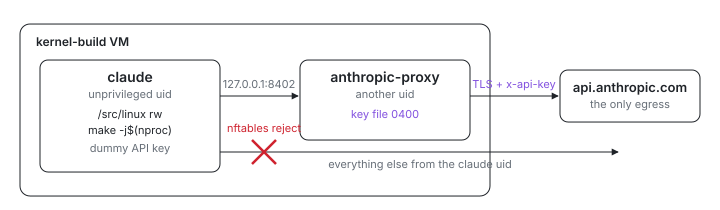

<p align="center">
  <picture>
    <source media="(prefers-color-scheme: dark)" srcset="assets/hero-dark.svg">
    
  </picture>
</p>

# Kernel build with a sandboxed Claude

How do you hand an AI agent a kernel tree and a compiler without also
handing it your API key or an internet connection? This VM fetches a Linux
checkout on first boot, carries the whole kbuild toolchain, and installs a
`claude` command that runs Claude Code as an unprivileged user whose only
network reach is a loopback proxy — the proxy holds the key, the agent
never sees it.

## Run

```sh
# From this directory (examples/kernel-build in the index repo).
ix secret set anthropic_api_key   # paste an Anthropic API key at the hidden prompt
ix apply .#kernel-build
```

Get the repo with `git clone https://github.com/indexable-inc/index`.

The kernel clone starts shortly after boot (it is timer-activated so a
~1.5 GB fetch never blocks VM readiness). Watch it land, then build:

```sh
ix shell kernel-build
journalctl -u git-clone.service -f   # until "Finished Clone ..."
cd /src/linux
make defconfig && make -j"$(nproc)"
```

And to hack with the agent, from the same shell:

```sh
cd /src/linux
claude
```

`claude` on PATH is a wrapper: it drops from the root shell into the
sandboxed `claude` user (keeping your working directory) and starts the real
Claude Code with `ANTHROPIC_BASE_URL` pointed at the proxy. The agent edits
the tree, runs `make`, reads `/nix/store` — everything a kernel developer
does, minus the key and the network.

## Shape

- [`default.ix`](default.ix) declares the VM. The repo URL, ref, and
  checkout path are the three consts at the top; the tree is fetched by the
  repo's boot-time [`services.git-clone`](../../modules/services/git-clone/default.nix)
  module (shallow, idempotent across reboots). The
  `deployment.secrets.anthropic_api_key` attachment materializes the stored
  key as `/run/secrets/anthropic/api-key`, owner `anthropic-proxy`, mode
  `0400`.
- [`toolchain.ix`](toolchain.ix) is the kbuild host: gcc, binutils, make,
  flex, bison, bc, perl, openssl, libelf, ncurses, pahole, and the
  `CPATH`/`LIBRARY_PATH` wiring that makes kbuild's host tools (objtool,
  menuconfig, extract-cert) compile outside a nix-shell. It also sets zsh as
  the VM shell.
- [`claude.ix`](claude.ix) is the sandbox, as intent: it enables the
  repo's [`services.sandboxed-agent`](../../modules/services/sandboxed-agent/default.nix)
  module and fills in the Anthropic-shaped values -- the `claude` user and
  uid, `pkgs.claude-code` as the confined command, the proxy's port,
  upstream host, credential header, and key file. The mechanism (users,
  proxy service, nftables policy, wrapper, health checks) lives in the
  module.
- The proxy itself is a small Rust binary
  ([`modules/services/sandboxed-agent/proxy`](../../modules/services/sandboxed-agent/proxy/src/main.rs)),
  auditable in one sitting: accept plain HTTP on `127.0.0.1:8402`, drop the
  client's credential headers, inject the real key from the 0400 file, and
  relay the TLS response from `api.anthropic.com` back byte for byte.

## The trust model, in plain words

Claude builds kernels as a normal user. The `claude` user owns
`/src/linux` (handed over after the root-run clone), its own home with
`~/.claude`, and `/tmp`; the nix store and toolchain are world-readable.
There is no bwrap or chroot layer — a plain uid is already the right
isolation for "can work, cannot read that file", and it keeps the build
environment identical to the one a human gets.

The key lives in another uid's 0400 file and only transits the proxy.
`/run/secrets/anthropic/api-key` is readable exclusively by the
`anthropic-proxy` user. The agent's `ANTHROPIC_API_KEY` is a dummy string;
the proxy strips it and injects the real header on the way to
`api.anthropic.com`. The key is never in the agent's environment, never in
a file it can open, never in a process it can ptrace (different uid).

The network policy pins claude to the proxy. An nftables output-hook rule
set keyed on the `claude` uid accepts TCP to `127.0.0.1:8402` and rejects
everything else — external addresses, IPv6, other loopback ports (so the
agent cannot probe local control-plane listeners either). The uid is
inherited by every process the agent spawns, and the wrapper starts the
session with `NoNewPrivileges`, so no descendant can shed it. Even a fully
hostile agent can neither read the key, nor exfiltrate it, nor reach the
internet: its packets die at the kernel's socket layer.

Two deliberate closures of indirect paths:

- DNS is irrelevant to the guarantee. The agent talks to a literal loopback
  address, and resolver traffic from its uid is rejected like any other
  packet, so there is no name-lookup step to poison and no DNS tunnel to
  ride.
- The nix daemon is scoped away. Any local user may normally ask the root
  daemon to realise a fixed-output derivation, which would fetch an
  attacker-chosen URL from outside the uid filter;
  `nix.settings.allowed-users` limits the daemon socket to operators.

What this does not defend against: the VM's root user (it can read
anything, including the key file), and the proxy's own upstream — the agent
can spend your Anthropic quota, because talking to the API is the one thing
it is supposed to do.

## Why an nftables uid match, not a network namespace

A netns-per-agent design (bwrap or `systemd-run` with only loopback, plus a
socket bridge to the proxy) isolates harder on paper but adds exactly the
moving parts that break the "can do real work" requirement: a private netns
needs the proxy socket bridged in (socat/unix-socket forwarders that buffer
SSE streams), and the sandbox mount plumbing has to replicate a working
kbuild host. The uid rule needs none of that: the agent lives in the real
filesystem and the real netns, and the kernel filters its sockets by owner.
The match is on the uid, not on a process tree or an interface, so it
covers forks, daemons, and anything the agent leaves behind. `reject`
rather than `drop` keeps failure fast and honest (telemetry and update
probes error immediately instead of hanging).

The `sandboxed-agent-egress` health check proves the behavior, not the
config: as the claude uid, connect to the proxy, then assert a direct
`https://api.anthropic.com` attempt fails fast.

## Known gaps

- `ix shell` currently lands in bash even though the VM's default shell is
  zsh (`users.defaultUserShell`); the fix is in flight in ix. Run `zsh`
  after `ix shell` meanwhile.
- The agent cannot `git fetch` — by design (no network). The tree is
  whatever ref the boot-time clone pinned; change the consts in
  `default.ix` and reapply to move it.
- Rotating the key follows the ix secrets model: `ix secret set
  anthropic_api_key` updates the store, but an existing VM keeps its
  materialized copy until recreated.

## Bad fit if

- You want CI-grade, cached, per-translation-unit kernel builds. That is
  [`lib/kernel/kbuild-unit.nix`](../../lib/kernel/kbuild-unit.nix)
  (index#3442), which builds kernels as content-addressed derivations. This
  example is the interactive complement: a mutable tree, a warm shell, an
  agent.
- You need the agent to browse docs or fetch crates. The only egress is the
  Anthropic API; that is the point.
