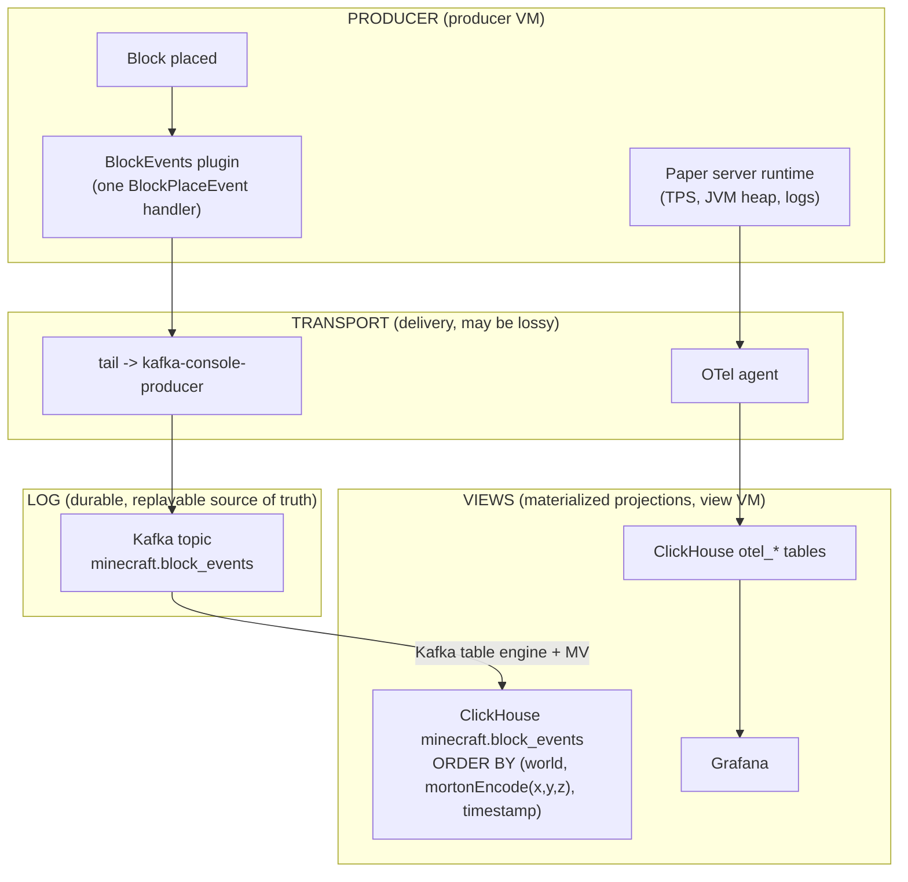

# Minecraft Blocks

Watch a single block placement flow from a Minecraft server to a 3D spatial
query. A player places a block, the placement becomes a durable fact in a log,
the log materializes into a ClickHouse table ordered by a space-filling curve,
and a bounding-box query over that table scans only the storage it needs.

This example is a working tour of the data architecture: a producer, one
durable log, and a view derived from that log. It also shows the contrast that
the architecture turns on: a block placement is a domain fact and travels the
log path, while the server's own telemetry travels a separate collector path
into the same database.

## Run

```sh
nix run .#minecraft-blocks-up
```

That brings up three VMs: `log` (the Kafka broker), `view` (ClickHouse, the
OTel collector, and Grafana), and `producer` (the Paper server with the
block-events plugin). Grafana is on port `3000` through the example's L7 proxy.

Query the spatial view from inside the view VM:

```sh
ix shell view -- mc-blocks total
ix shell view -- mc-blocks top-players
ix shell view -- mc-blocks box overworld 0 0 0 16 320 16
ix shell view -- mc-blocks heatmap overworld
```

You do not need a running server to see the pipeline end to end. The Rust
emitter writes the same records the plugin writes, so the integration check
drives the whole log-to-view path offline (see [Validation](#validation)).

## The three layers



There are two legs, and keeping them apart is the point.

TRANSPORT is how facts arrive. It is a delivery choice and is allowed to be
lossy. Here it is a file tail piped into a Kafka producer. It is not the source
of truth.

LOG is the one durable, append-only, replayable source of truth. Here it is the
`minecraft.block_events` Kafka topic. Everything downstream derives from it and
is rebuildable by replaying it.

VIEWS are projections of the log, one per query pattern. Here the view is a
ClickHouse table tuned for spatial range queries. The same log could feed other
views without touching the producer.

## Domain facts versus telemetry

A block placement is a domain fact: structured data you aggregate, count, and
range-query later. Domain facts go through the log so they are durable and
replayable, and they land in a view shaped for the questions you ask of them.

The server's own signals (tick rate, JVM heap, lag, logs) are telemetry. Those
go through the OpenTelemetry collector into the `otel_*` tables, the same path
every other service in the fleet uses. The diagram shows both legs side by side
because the architecture only works when you put each kind of data on the right
one. A block-place is not telemetry, so it never goes through the collector.

Both legs land in one ClickHouse. The `view` node runs the shared
`services.ix-observability` stack (ClickHouse, collector, Grafana) and adds the
`minecraft` database on that same server, so telemetry and block facts share a
database without a second ClickHouse.

## Why ClickHouse and not Mixedbread

Block placements are facts to aggregate and range-query (counts per player, a
bounding box, a per-chunk heatmap), so the view is a columnar table in
ClickHouse, not a vector index. There is nothing here to search semantically.

The log makes that a per-view choice, not a fork in the road. The same
`minecraft.block_events` log could also feed a Mixedbread view if you wanted
text search over, say, the contents of written books or command signs. One log,
many views: you add the view you need and replay the log into it.

## The space-filling curve

This is how far the spatial view can go. The view's sorting key linearizes the
three coordinates with a Z-order (Morton) curve:

```sql
ENGINE = MergeTree
ORDER BY (world, mortonEncode((1, 1, 1), toUInt32(x + 1048576), toUInt32(y + 1048576), toUInt32(z + 1048576)), timestamp)
```

`mortonEncode` interleaves the bits of the three axes into one integer. Points
that are close in 3D space get close curve values, so they sort next to each
other on disk. ClickHouse stores rows in this order and indexes them in
granules, so a 3D bounding-box query (or a radius query) maps to a small set of
contiguous granule ranges. ClickHouse skips the granules outside those ranges
instead of scanning the whole table. Sorting by `world` first keeps each world
a contiguous run; `timestamp` last orders rows within a curve cell.

Two details matter, and both are why the offset constant exists.

Minecraft coordinates are signed (negative coordinates are legal), but
`mortonEncode` takes unsigned integers. Each axis is shifted into an unsigned
range by adding a fixed offset before encoding and subtracting it after
decoding. The offset lives once in `schema.nix` and is applied identically by
the table, the loader, and the round-trip check.

Three axes interleaved into a 64-bit curve value give each axis 21 bits, so each
shifted coordinate must fit in `[0, 2^21)`. The offset is `2^20`, which centers
a roughly plus-or-minus one million block window on the curve. That covers any
normal build area. To cover the full plus-or-minus 30 million block range, a
production table partitions by region first and Morton-encodes within each
bounded partition, the same idea applied per partition.

## Scaling up

The runnable substrate here is Apache Kafka in KRaft mode, the broker this
nixpkgs packages. Redpanda is the intended production substrate: it speaks the
Kafka API, so the producer and the ClickHouse Kafka table engine are unchanged,
and this nixpkgs currently ships only the Redpanda client (`rpk`), not the
broker. The log is the same shape either way.

The payoff at scale comes from materializing the log as a table that many views
derive from. With Redpanda Iceberg Topics, the broker writes the topic out as an
Iceberg table as records arrive. That Iceberg table then feeds many views from
the one log:

- ClickHouse for the spatial and aggregate queries shown here,
- DuckDB for ad hoc analysis straight off the Iceberg files,
- a dedicated spatial index if a workload needs one.

Each view is a projection you can rebuild by replaying the log, so adding or
reshaping a view never touches the producer and never risks the source of truth.

## Shape

- `schema.nix` is the one source of truth for the event: the field list, the
  topic name, the Morton offset, and the ClickHouse DDL all derive from it, so
  the plugin, the log, the table, and the queries cannot drift apart.
- `log.nix` runs the Kafka broker and creates the topic.
- `view.nix` runs the shared observability ClickHouse and adds the spatial
  view, a Kafka table engine reading the topic, and a materialized view that
  copies consumed rows into the spatial table.
- `producer.nix` runs Paper with the block-events plugin, ships its records to
  the topic, and forwards the server's telemetry to the collector.
- `packages.nix` builds the Rust emitter, the plugin jar, and the integration
  check.
- `plugin/` is the Paper plugin: one `BlockPlaceEvent` handler that writes one
  JSON Lines record per placement.
- `emitter/` is the Rust emitter that writes byte-identical records, so the
  pipeline is testable without a server.

## Validation

The integration check runs the whole log-to-view path offline. It runs the Rust
emitter, loads the records into a ClickHouse `local` table built from the same
schema (same Morton order, same offset), runs the bounding-box query, and
asserts the exact in-box count plus the Morton round-trip:

```sh
nix build .#checks.x86_64-linux.eval
```

The eval aggregate also evaluates the fleet's config assertions (the KRaft
broker, the shared ClickHouse, the spatial view, both producer legs) and builds
the emitter and the plugin jar.
