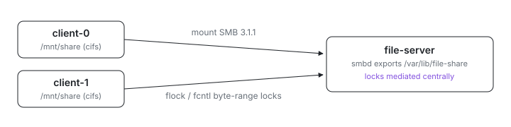

<p align="center">
  <picture>
    <source media="(prefers-color-scheme: dark)" srcset="assets/hero-dark.svg">
    
  </picture>
</p>

# Multi-client file sharing

Ever had two VMs clobber the same file because their locks never saw each
other? These VMs share one directory over SMB 3.1.1 with locking that
actually coordinates: a `file-server` VM exports `/var/lib/file-share`, two
client VMs mount it at `/mnt/share`, and
`smbd` mediates every `flock()` and `fcntl` byte-range lock centrally, so a
lock taken on `client-0` blocks `client-1`.

## Run

```sh
# From this directory (examples/multi-client/file-sharing in the index repo).
ix apply .#file-server .#client-0 .#client-1
```

Each VM declares its own health check (smbd active on the server, the CIFS
mount present on each client). Get the repo with
`git clone https://github.com/indexable-inc/index`.

## Shape

- [`default.ix`](default.ix) wires one server VM and two clients; the
  clients get the server as a peer through `mkVm`'s `nodes`, so the mount
  resolves it by name.
- [`server.nix`](server.nix) configures Samba with the locking knobs
  (`strict locking`, `posix locking`, `kernel oplocks = no`,
  `strict sync = yes`) that keep two clients honest about each other's writes.
- [`client.nix`](client.nix) declares the CIFS mount with `vers=3.1.1` and
  leaves `nobrl` absent so byte-range locks stay enabled.

## Verify cross-client locking

Hold an exclusive `flock` on a file from one client:

```sh
ix shell client-0 -- flock -x /mnt/share/lockfile -c 'sleep 60'
```

From a second host shell, try to grab the same lock from the other client
non-blocking:

```sh
ix shell client-1 -- flock -nx /mnt/share/lockfile -c 'echo got-it'
```

The second invocation exits with status 1 until the first releases. Swap
`flock` for `python -c 'import fcntl; fcntl.lockf(...)'` to exercise the same
path via `fcntl` byte-range locks.

## Tradeoffs

- The share is **guest-writable** so `ix apply` works without secrets
  plumbing. Real deployments should drop `guest ok = yes` from
  [`server.nix`](server.nix), add a Samba user with `smbpasswd`, and pass
  `credentials=` to the CIFS mount through a systemd `LoadCredential` (the
  same shape [`python/daily-scraper`](../../python/daily-scraper) uses for
  AWS keys).
- ix VMs share the host `linux-ix` kernel, so the SMB server has to be
  userspace `smbd` rather than in-kernel `ksmbd`. The client side still rides
  on `cifs.ko` from the host kernel.
- `strict sync = yes` plus `actimeo=1` trade some throughput for prompt
  cross-client visibility. Append-only or single-writer workloads can relax
  both.
