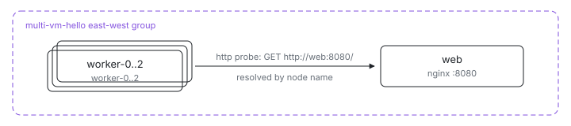

<p align="center">
  <picture>
    <source media="(prefers-color-scheme: dark)" srcset="assets/hero-dark.svg">
    
  </picture>
</p>

# Multi-VM hello

What does a Kubernetes Service plus a three-replica Deployment look like as
one Nix file? This is the smallest multi-VM app: one `web` VM serving a
static page and three interchangeable `worker` VMs that resolve it by name
with `ix.endpointOf nodes.web "http"` and declare reaching it as their
health check — an `httpGet`-style probe written as `http = { host; port; }`,
no hand-written curl.

## Run

```sh
# From this directory (or the index repo's examples/multi-vm/hello).
ix apply .#web .#worker-0 .#worker-1 .#worker-2
```

Need the repo first? `git clone https://github.com/indexable-inc/index`.

## Shape

- [`default.ix`](default.ix) declares the VMs: one `web` and three workers,
  all in one east-west group. Each worker gets the web VM as a peer through
  `mkVm`'s `nodes` argument, which is what `ix.endpointOf` resolves against.
- [`web.nix`](web.nix) runs nginx and declares `ix.networking.expose.http`,
  which opens the firewall, registers the port claim, and names the endpoint
  workers resolve. Its readiness is a one-line `http.port` probe.
- [`worker.nix`](worker.nix) resolves that endpoint and probes it with
  `http = { host = web.host; port = web.port; }` — the platform derives the
  curl command and keeps the probe binary in the image.

## Verify

```sh
ix shell worker-0 -- curl --fail http://web:8080/
```

Workers are named `worker-0` through `worker-2`; each reaches `web` by its
VM name over the east-west network. `ix shell web -- journalctl -u nginx`
pulls the nginx journal from the web VM.

## Scale

Another worker is one line in [`default.ix`](default.ix): add
`worker("worker-3")` and apply it. It joins the group and picks up the same
health check.
