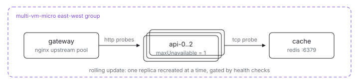

<p align="center">
  <picture>
    <source media="(prefers-color-scheme: dark)" srcset="assets/hero-dark.svg">
    
  </picture>
</p>

# Multi-VM microservices

A three-tier service — edge proxy, replicated stateless API, shared cache —
as four short Nix files. The pieces you would reach to Kubernetes for are all
here, declared next to the software they describe:

| You'd use in Kubernetes   | Here                                                    |
| ------------------------- | ------------------------------------------------------- |
| Deployment with replicas  | three `api` VMs declared in [`default.ix`](default.ix)  |
| Service discovery / DNS   | `ix.endpointOf nodes.cache "redis"` by VM name          |
| `httpGet` readiness probe | `ix.healthChecks.ready.http = { port; path; }`          |
| `tcpSocket` probe         | `ix.healthChecks.cache-reachable.tcp = { host; port; }` |
| Ingress / LoadBalancer    | the `gateway` VM's nginx upstream pool                  |

Unlike a Kubernetes manifest (or a Nomad job), the wiring *is* the machine
definition: the same file that lists the api VMs also configures nginx, and
the gateway derives its upstream pool from the peers wired into it at eval
time — add an api VM and the pool and per-VM probes grow to match, before
anything deploys.

## Run

```sh
# From this directory (or the index repo's examples/multi-vm/microservices).
ix apply .#cache .#api-0 .#api-1 .#api-2 .#gateway
```

Need the repo first? `git clone https://github.com/indexable-inc/index`.

## Shape

- [`default.ix`](default.ix) — the wiring: `cache`, three api VMs, and
  `gateway`, all in one east-west group; the gateway gets the api VMs as
  peers through `mkVm`'s `nodes` argument.
- [`cache.nix`](cache.nix) — redis, exposed to the group as `redis`, probed
  with a one-line `tcp.port` check.
- [`api.nix`](api.nix) — nginx standing in for a real service; each api VM
  reports its own name. Declares an `http` readiness probe on `/healthz`
  and a cross-VM `tcp` probe that the cache is reachable.
- [`gateway.nix`](gateway.nix) — nginx upstream pool built from the api VMs
  wired in at eval time, plus one generated `http` probe per VM, so an
  unreachable upstream is named exactly.

## Verify

```sh
# Round-robin through the api VMs via the gateway:
ix shell gateway -- curl --silent http://127.0.0.1:8080/  # {"service":"api","node":"api-1"}

# Journals, kubectl-logs style:
ix shell cache -- journalctl -u redis-cache -n 50
```

## Scale

Another api VM is one line in [`default.ix`](default.ix): add `api("api-3")`
to the gateway's peers and apply it. It joins the east-west group, inherits
the same probes, and appears in the gateway's upstream pool and per-VM
checks.
