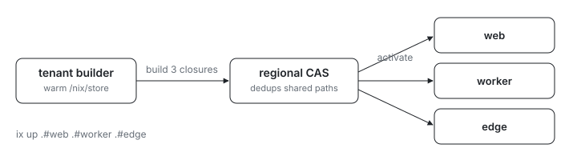

<p align="center">
  <picture>
    <source media="(prefers-color-scheme: dark)" srcset="assets/hero-dark.svg">
    
  </picture>
</p>

# NixOS switch: many VMs, one command

How do you rebuild several NixOS VMs without routing every closure through
your laptop? This example switches three VMs in a single command: the source
uploads to each target, every VM builds its own closure in place, and
regional CAS deduplicates the shared system paths between them, so siblings
substitute most of what the first build produced instead of rebuilding it.

## Run

```sh
# From this directory (examples/nixos/switch-multi in the index repo).
ix apply .#web .#worker .#edge
```

The command creates `web`, `worker`, and `edge` from `ix/base` if they do
not exist, builds each closure on its own VM, and activates it in place.
Re-run it to converge them, the same contract as `nixos-rebuild switch`.

## The loop

1. Edit a configuration in [`default.ix`](default.ix): change a VM's package
   list.
2. Run the multi-VM `ix apply` again. Only the changed closures rebuild;
   unchanged VMs are a no-op.
3. `ix shell web -- rg --version` (or `worker -- jq`, `edge -- hello`)
   confirms the new closure is live.

## Rules

- Each target names its own configuration (`.#web`), so `--name` is not used
  with multiple targets.
- A failed target is reported on its own; its siblings still switch.

## Shape

- [`flake.nix`](flake.nix) is the entrypoint; unlike the `mkVm` examples it
  exposes raw `nixosConfigurations` (`web`, `worker`, `edge`).
- [`default.ix`](default.ix) builds those systems; each target differs only
  by its sentinel package.
- [`configuration.nix`](configuration.nix) is the shared NixOS module every
  VM switches onto. It imports `virtualisation/docker-image.nix` so the
  system evaluates against the `ix/base` image without a bootloader.

## Fork it

Copy this directory, add or rename configurations in
[`default.ix`](default.ix), and apply your own targets. The `index` flake
input pulls `github:indexable-inc/index` for you; no admin rights are
needed.
