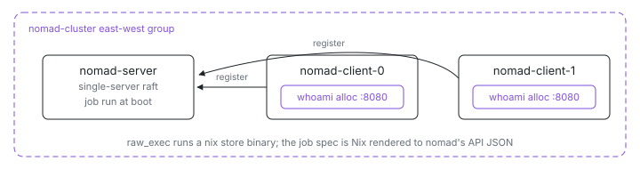

<p align="center">
  <picture>
    <source media="(prefers-color-scheme: dark)" srcset="assets/hero-dark.svg">
    
  </picture>
</p>

# Nomad on Nix

A Nomad cluster - one server, two clients - built on the pairing that makes
Nomad unusually good on NixOS: `raw_exec` plus the nix store. The job's
"artifact" is a store path the clients already have in their system closure,
so there is no Docker, no registry, no artifact download - the scheduler
places a process, and Nix has already delivered its entire dependency tree.

| Usually                         | Here                                                          |
| ------------------------------- | ------------------------------------------------------------- |
| HCL config files                | `services.nomad.settings` as Nix values in [`node.nix`](node.nix) |
| a `.nomad` HCL job spec         | Nix rendered to nomad's API JSON in [`job.nix`](job.nix)      |
| Docker images for the workload  | a store binary pinned by [`client.nix`](client.nix)           |
| `nomad job run` by hand         | a boot-time oneshot submits the rendered spec                 |
| static IPs in configs           | go-sockaddr `GetPrivateIP` + east-west hostnames              |

One count, one contract: [`job.nix`](job.nix) derives the allocation count
from the client VMs wired in via `nodes`, and the static port keeps
allocations from co-locating, so the scheduler spreads exactly one `whoami`
per client.

## Run

```sh
ix apply .#nomad-server .#nomad-client-0 .#nomad-client-1
```

Need the source first? `git clone https://github.com/indexable-inc/index`
and run it from `examples/nomad/cluster`. Apply order does not matter:
clients retry registration until the server answers, the server submits the
job once its API is up, and each client's `whoami-http` probe gates success
on the allocation placed there actually answering.

## Shape

- [`default.ix`](default.ix) - the VMs: `nomad-server` and two
  `nomad-client-*` VMs built from one module, one east-west group.
- [`node.nix`](node.nix) - what every agent shares: the nomad service,
  datacenter, bind/advertise addressing, a liveness check.
- [`server.nix`](server.nix) - single-server raft plus the cluster ports
  (http, rpc, serf).
- [`client.nix`](client.nix) - registration by the server's east-west
  hostname, `raw_exec` enabled, the workload binary pinned into the closure.
- [`job.nix`](job.nix) - the job spec as Nix, rendered by `pkgs.formats.json`
  and submitted by a boot-time oneshot; plus the job-registered check.
- [`whoami.nix`](whoami.nix) / [`whoami.py`](whoami.py) - the workload: a
  tiny http server reporting its allocation and node from `NOMAD_*` env.
- [`ports.nix`](ports.nix) - every port, stated once.

## Verify

```sh
# Real nomad CLI against a real cluster:
ix shell nomad-server -- nomad server members
ix shell nomad-server -- nomad job status whoami

# Each client's allocation answers on 8080 and names itself:
ix shell nomad-client-0 -- curl --silent http://127.0.0.1:8080/  # {"alloc":"web.whoami[0]","node":"nomad-client-0"}

ix shell nomad-server -- journalctl -u nomad -n 50
```

## Scale

Add `nomad-client-2` to the client list in [`default.ix`](default.ix). The
job's `Count` and the per-client probes both follow from the same VM list -
one line, and the scheduler fills the new client.

## License note

Nomad is BUSL 1.1 since 1.6 (unfree in nixpkgs); this repo allowlists it by
name in `lib/image/default.nix` for exactly this demo. Prefer the
[`k8s/k3s`](../../k8s/k3s) example when license cleanliness matters.
