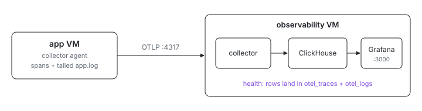

<p align="center">
  <picture>
    <source media="(prefers-color-scheme: dark)" srcset="assets/hero-dark.svg">
    
  </picture>
</p>

# Observability stack

Where do spans and logs go when your app runs in a VM you created five
minutes ago? These two VMs self-host the whole pipeline: an `observability`
VM runs an OpenTelemetry collector, ClickHouse, and Grafana, and an `app`
VM exercises both instrumentation paths by sending a span through its local
collector agent and writing a log line the agent tails. A health check holds
the app VM unhealthy until both records actually land in ClickHouse.

For how the telemetry pipeline works end to end, with diagrams, see the
[module README](../../../modules/services/observability/README.md).

## Run

```sh
# From this directory (examples/observability/stack in the index repo).
ix apply .#observability .#app
```

Grafana is on port `3000` through the example's L7 proxy. The
ClickHouse-backed query helper is available inside the observability VM:

```sh
ix shell observability -- ix-observe logs --limit 20
ix shell observability -- ix-observe slow-spans
```

Get the repo with `git clone https://github.com/indexable-inc/index`.

## Shape

- [`default.ix`](default.ix) wires the two VMs into one east-west group;
  `observability` runs
  [`services.ix-observability`](../../../modules/services/observability/)
  from a small inline module.
- `app` enables only the local collector agent and forwards OTLP to
  `observability:4317`.
- [`app.nix`](app.nix) proves both instrumentation paths: direct OTLP spans
  and file-tailed logs.

## Swap in your service

Keep the observability node, then add this to an application VM:

```nix
{
  services.ix-observability = {
    stack.enable = false;
    agent = {
      enable = true;
      endpoint = "observability:4317";
      filelog.paths = [ "/var/log/my-service/*.log" ];
    };
    resourceAttributes."ix.app" = "my-service";
  };
}
```

Use normal OpenTelemetry SDK settings in the app, pointed at
`127.0.0.1:4317`. The local collector handles batching, resource labels, and
the remote write to ClickHouse.
