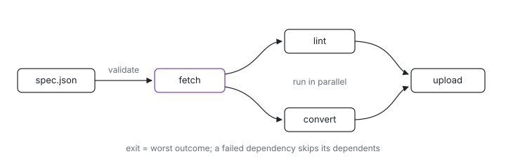

<p align="center">
  <picture>
    <source media="(prefers-color-scheme: dark)" srcset="assets/hero-dark.svg">
    
  </picture>
</p>

# dag-runner

Need to fan out a handful of shell commands with dependencies between them and get one honest exit code back? dag-runner takes a JSON DAG of commands, runs each node as soon as its dependencies succeed (independent nodes in parallel), renders inline progress, and exits with the worst outcome. It powers `nix run .#health-checks` today and is the planned replacement for [`ix-fleet`](../ix-fleet/)'s sequential per-node loops.

A node is either a **task**, which runs to completion, or a **service**, which stays up while the rest of the graph uses it. Dependents start when their dependencies are *ready*, and the two kinds answer that differently: a task is ready when it exits zero, a service when its readiness probe passes. That is what lets a client wait for the port its server is about to open instead of for a sleep long enough to probably work.

The run is over when the last task settles. Any service still up is then stopped as a group, which also means a spec containing no tasks at all runs until Ctrl-C — supervising a set of services is just the degenerate case of the same rule.

For the design rationale (why not `process-compose`, why not `devenv-tasks`), see [the corresponding AGENTS.md section](../../AGENTS.md#why-dag-runner-and-not-process-compose-or-devenv-tasks).

## Get it

```sh
cargo install --git https://github.com/indexable-inc/index dag-runner
```

Inside a clone of the monorepo it is also the `dag-runner` flake package
(`nix run .#dag-runner`). Get the repo with
`git clone https://github.com/indexable-inc/index`.

## Usage

```
dag-runner <spec.json> [--output auto|tui|plain|json] [--only NAMES]
```

`--output auto` (default) picks `tui` when stdout is a TTY and `plain` otherwise. `json` emits NDJSON events to stdout and a final `summary` line; everything else still goes to stderr.

`--only` restricts the run to the named nodes (comma-separated, repeatable: `--only a,b --only c`). Unknown names and edges left dangling by the cut (a kept node depending on a dropped one) are rejected before any node is spawned, so a filtered run keeps the same "every kept node has every dep it needs" invariant as an unfiltered run.

## Spec schema

The spec is a single JSON object with a `nodes` map. Each entry is a node keyed by name.

| field | type | required | meaning |
| --- | --- | --- | --- |
| `command` | `string[]` | yes | argv. `command[0]` is the program, the rest are arguments. Must be non-empty. |
| `depends_on` | `string[]` | no, default `[]` | Names of other nodes that must succeed first. |
| `env` | `{string: string}` | no, default `{}` | Extra env vars layered on top of the runner's own env. Entries here shadow inherited vars; missing entries are inherited from the parent. |
| `timeout_secs` | `u64` | no, default `null` | Wall-clock seconds before the child is SIGTERMed (then SIGKILLed after ~500ms grace). On expiry the outcome is `failed` with exit code `124` (matches `coreutils timeout`) and the captured stderr ends with `dag-runner: node timed out after Ns`. Rejected on a service, which is not supposed to finish. |
| `kind` | `"task"` \| `"service"` | no, default `"task"` | Whether the node runs to completion or stays up. |
| `ready_when` | probe object | required on a service, rejected on a task | What makes a service ready. See below. |
| `ready_timeout_secs` | `u64` | no, default `60` | How long a service may take to satisfy `ready_when`. On expiry the service is `failed` with exit code `124` and the group comes down. |
| `stdio` | `"capture"` \| `"prefixed"` \| `"inherit"` | no, default `"capture"` | Where the child writes. See [Child output](#child-output). |
| `lifeline_fd` | `i32` | no, default `null` | Hand the child the read end of a pipe on this descriptor. Must be 3 or above. See [Lifelines](#lifelines). |

### Readiness probes

`ready_when` is one of three shapes, and each is polled every 100ms with a 2s cap on any single attempt:

```json
{ "tcp":      { "address": "127.0.0.1:7533" } }
{ "log_line": { "pattern": "Listening on", "stream": "stderr" } }
{ "http":     { "url": "http://127.0.0.1:7533/api/wire", "status": 200, "body_contains": "9f2c…" } }
```

| probe | fields | notes |
| --- | --- | --- |
| `tcp` | `address` | Ready when a connection is accepted. Re-resolved every attempt, so a name not yet in DNS still works once it is. |
| `log_line` | `pattern`, `stream` | Ready when a line on the chosen stream contains `pattern` as a **substring** — not a regex. `stream` is `"stdout"`, `"stderr"` or `"either"` (default). Needs a captured stream, so it cannot be combined with `"stdio": "inherit"`. |
| `http` | `url`, `status`, `body_contains` | Ready on a response whose status equals `status` (default `200`) and, when `body_contains` is set, whose body contains that substring. |

Reach for `body_contains` whenever a dependent parses what the service returns. A port that accepts and a server that speaks the wire your client understands are different claims, and the gap between them fails silently: the client connects, gets frames it cannot read, and renders an empty window while every write it makes lands on a real server.

Validation runs before any node is spawned and rejects:

- An empty `command` array.
- A `depends_on` entry that names an unknown node (error names both nodes).
- A cycle, direct (`a → a`) or indirect (`a → b → c → a`). The error shows the cycle path.
- A service with no `ready_when`, or a task with one.
- A service with `timeout_secs`.
- `log_line` readiness on a node whose `stdio` is `inherit`.
- A `lifeline_fd` below 3.
- An unknown field anywhere in the spec. A misspelled `ready_when` would otherwise leave a service that never becomes ready and a spec that looks right.

Nodes are spawned in topological order; siblings without a dependency relationship may run concurrently. When the runner has to break ties (independent roots, or siblings inside one layer), it walks names in lexicographic order so logs stay stable across runs.

## Example

```json
{
  "nodes": {
    "fetch":   { "command": ["curl", "-fsSL", "https://example.test/data.json", "-o", "data.json"] },
    "lint":    { "command": ["jq", ".", "data.json"], "depends_on": ["fetch"] },
    "convert": { "command": ["./bin/convert", "data.json", "out.bin"], "depends_on": ["fetch"], "env": { "RUST_LOG": "debug" } },
    "upload":  { "command": ["./bin/upload", "out.bin"], "depends_on": ["lint", "convert"] }
  }
}
```

`lint` and `convert` run in parallel after `fetch`. `upload` waits for both. A failure in `fetch` propagates: `lint`, `convert`, and `upload` all end up `skipped`.

### A client and the server it needs

```json
{
  "nodes": {
    "server": {
      "kind": "service",
      "command": ["./bin/api-server", "--listen", "127.0.0.1:7533"],
      "ready_when": { "http": { "url": "http://127.0.0.1:7533/api/wire", "body_contains": "9f2c1b" } },
      "ready_timeout_secs": 30,
      "stdio": "prefixed",
      "lifeline_fd": 3
    },
    "app": {
      "command": ["cargo", "run", "-p", "app"],
      "depends_on": ["server"],
      "stdio": "inherit"
    }
  }
}
```

`app` starts once `server` answers `/api/wire` with the expected wire hash, not merely once the port is open. When `app` exits — for any reason, including a compile error — `server` is stopped and recorded as `stopped`, and the runner exits with `app`'s code. If `server` dies first, `app` is terminated and the run ends there rather than continuing against a server that is gone.

## Failure propagation

A **task** failing skips the nodes that depend on it and leaves everything else alone. An unrelated branch runs to completion, which is what makes the runner useful for a fan-out of independent checks: one failing does not cancel the other four.

A **service** failing takes the whole group down. That is the difference between the two: a service exists to be depended on, so once it is gone nothing still running can produce a result worth believing. Every running node is SIGTERMed (then SIGKILLed after ~500ms), everything not yet started is `skipped`, and a terminated task records exit `143` — `128 + SIGTERM`, so the number says the runner stopped it rather than that it failed on its own.

A service is `failed` only when the service itself failed: it exited before becoming ready, it exited while the run was still going, or it never satisfied `ready_when`. A service the runner stopped for any other reason — the run finished, the operator hit Ctrl-C, some other node failed — is `stopped`, which contributes nothing to the exit code.

One consequence worth knowing: the runner learns that a node's process has exited by draining its output streams first and reaping it second, deliberately, so that the process group ID cannot be recycled while teardown is still using it. A surviving grandchild that holds the inherited pipe open therefore delays that detection. Nodes using `"stdio": "inherit"` have no pipes and so are detected the instant they exit.

## Child output

`stdio` decides where a node's output goes:

- **`capture`** (default): piped and retained. Only the newest line is visible while the node runs, on its spinner; the whole retained tail is dumped at the end if the node failed.
- **`prefixed`**: piped and retained as above, and each line is *also* echoed as `name | line` as it arrives — above the spinners in `tui`, and always on stderr so `--output json`'s stdout stays parseable. Use it for a service whose log you want to watch live.
- **`inherit`**: the child writes straight to the runner's own stdout and stderr. Its terminal detection and colour survive, which matters for an interactive child like `cargo tauri dev`, but nothing is captured: there is no failure dump, and `log_line` readiness has nothing to read.

Because an inheriting child writes over indicatif's spinners and into the NDJSON stream, `--output auto` resolves to `plain` when any node inherits, and an explicit `--output tui` or `--output json` alongside one is a validation error naming the node rather than a run whose output cannot be trusted.

Retained output is bounded at the last **500 lines** per stream — a service can run for hours, so keeping every line would be an unbounded allocation on exactly the path services exist for. When lines are dropped the dump says so, on its first line:

```
dag-runner: 1500 earlier lines dropped (keeping the last 500)
```

## Output modes

- **`tui`**: an indicatif `MultiProgress` with one inline spinner per node. Spinners stay in scrollback after they finish, so a failure leaves its line visible. Live stdout/stderr from each child is captured (not streamed) and dumped at the end for failed nodes.
- **`plain`**: timestamped `started` / `ready` / `<outcome>` lines to stdout. No spinners, no alt-screen.
- **`json`**: NDJSON event stream on stdout. See below.
- **`auto`**: `tui` when stdout is a TTY, `plain` otherwise.

In every mode, after all nodes settle, a one-line summary plus a per-node breakdown (and captured stdout/stderr for any failed nodes) is written to stderr.

## `--output json` event schema

One JSON object per line. Four event shapes, discriminated by `event`:

```json
{ "event": "node_started",  "node": "fetch", "ts_ms": 12 }
{ "event": "node_ready",    "node": "server","ts_ms": 240 }
{ "event": "node_finished", "node": "fetch", "outcome": "succeeded", "exit_code": null, "duration_ms": 412 }
{ "event": "node_finished", "node": "lint",  "outcome": "failed",    "exit_code": 1,    "duration_ms": 87  }
{ "event": "node_finished", "node": "upload","outcome": "skipped",   "exit_code": null, "duration_ms": 87  }
{ "event": "node_finished", "node": "server","outcome": "stopped",   "exit_code": null, "duration_ms": 900 }
{ "event": "summary", "total": 4, "succeeded": 1, "failed": 1, "skipped": 2, "stopped": 0, "duration_ms": 510 }
```

`node_ready` is emitted only by services. A spec of nothing but tasks produces the same stream it always did, plus `"stopped": 0` on the summary.

| field | type | notes |
| --- | --- | --- |
| `node` | string | Node name from the spec. |
| `ts_ms` | u128 | Milliseconds since the runner started (only on `node_started`). |
| `outcome` | `"succeeded"` \| `"failed"` \| `"skipped"` \| `"stopped"` | Final state. `skipped` means a dependency was never ready, or the group was already coming down when this node's turn arrived. `stopped` is a service the runner took down; it is not a failure. |
| `exit_code` | i32 \| null | Set when `outcome == "failed"`. `null` otherwise. A spawn error (binary missing, etc.) surfaces as `outcome: "failed"` with `exit_code: 127`. |
| `duration_ms` | u128 | On `node_finished`, time the runner spent on that node (from spawn to exit, or zero for skipped). On `summary`, total wall-clock time. |

Ordering guarantees:

- For one node, `node_started` always precedes its `node_finished`.
- A node's `node_started` does not appear until every dependency is ready: `node_finished` for a task dependency, `node_ready` for a service one.
- A service's `node_ready` precedes its own `node_finished`, and a service that never became ready emits no `node_ready` at all.
- Independent nodes run concurrently. Their `node_started` and `node_finished` lines may interleave in any order between nodes.
- `summary` is the final line.

## Exit code

```
exit_code = max(worst node exit code, 1 if any node was skipped, else 0)
```

Concretely:

- Empty spec or every node succeeded: `0`.
- One node failed with exit `N`: `N`.
- Multiple failures: the largest non-zero `exit_code` across failed nodes wins.
- At least one node was skipped (because a dep failed) and no failure had a larger code: `1`.
- A node could not be spawned: counted as `failed` with `exit_code = 127`.
- A node hit its `timeout_secs`, or a service never satisfied `ready_when` within `ready_timeout_secs`: counted as `failed` with `exit_code = 124`.
- A node the runner terminated because a service failed: counted as `failed` with `exit_code = 143` (`128 + SIGTERM`).
- A service the runner stopped: `stopped`, contributing `0`.
- The operator hit Ctrl-C: every running child is SIGTERMed (then SIGKILLed after ~500ms grace), and the runner exits `130` regardless of which nodes had already finished. A second Ctrl-C hard-exits immediately.

CI pipelines should treat any non-zero exit as a stop signal and read stderr for the per-node breakdown and captured child output.

## Lifelines

`kill -9` on the runner runs no teardown at all, so a service it started outlives it — holding its port, its runtime directory and its own children, invisibly, until someone notices.

`lifeline_fd: N` closes that hole without the child having to trust the runner to behave. The runner creates a pipe, hands the child the read end on descriptor `N`, and keeps the write end for its own lifetime. The child blocks on or polls that descriptor; when the runner's process ends — cleanly, crashed, or SIGKILLed — the kernel closes the write end and the child sees EOF. The write end is `CLOEXEC`, so no other node inherits it and one node's lifeline cannot be held open by another's child.

```json
{ "command": ["./bin/server", "--lifeline-fd", "3"], "kind": "service", "lifeline_fd": 3,
  "ready_when": { "tcp": { "address": "127.0.0.1:7533" } } }
```

This is a cooperative guard: it does nothing unless the child actually watches the descriptor. It complements the process-group teardown rather than replacing it — that covers every exit the runner lives to see, and this covers the ones it does not.
