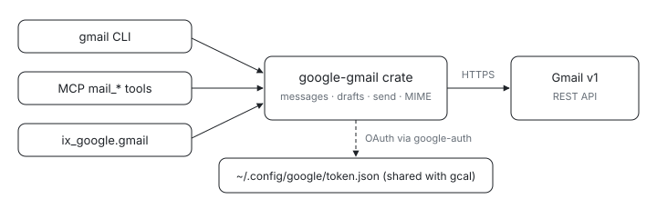

<p align="center">
  <picture>
    <source media="(prefers-color-scheme: dark)" srcset="assets/hero-dark.svg">
    
  </picture>
</p>

# google-gmail

Want your shell or your agent to search, read, and send Gmail without a browser tab? This is Gmail for agents and shells: one Rust crate owns the [Gmail v1 API](https://developers.google.com/gmail/api/reference/rest) (messages, threads, labels, drafts, send, attachments) and the MIME builder for outgoing mail, and three thin surfaces expose it, so the CLI, the MCP tools, and the Python binding all return the same wire types.

The three surfaces, per
[RFC 0003](../../site/src/lib/rfcs/0003-mcp-composable-clis.svx): the `gmail` CLI
in [`cli/`](./cli), the `mail_*` tools in the `ix-google-mcp` Rust server in
[`packages/google/mcp`](../mcp), and the `ix_google.gmail.Client` Python class in
[`packages/google/py`](../py). Tracks
[#599](https://github.com/indexable-inc/index/issues/599) and
[#644](https://github.com/indexable-inc/index/issues/644).

OAuth is shared with the calendar crate through `google-auth`: one consent flow
per workstation grants the union of every scope the repo knows about, and the
stored token lives in `~/.config/google/token.json` (mode 0600).

## Get it

```sh
nix run github:indexable-inc/index#gmail -- --help
```

From a clone (`git clone https://github.com/indexable-inc/index`): `nix run .#gmail`.
The crate itself (`google-gmail`) is an unmirrored workspace library; consume it
through Nix or one of the three surfaces above.

## Just want to send mail? Skip Google entirely

`mail_send_message` in the MCP server submits over SMTP whenever SMTP is
configured, which needs no Google Cloud project, no OAuth client, and no
consent flow:

```sh
export IX_SMTP_HOST=smtp.fastmail.com
export IX_SMTP_USER=you@fastmail.com
export IX_SMTP_PASSWORD='<app password>'
# optional: IX_SMTP_PORT (default 587; 465 for implicit TLS), IX_SMTP_FROM
```

That covers Fastmail, Proton Bridge, iCloud, Zoho, Migadu, self-hosted, and
corporate Exchange. It builds the message with the same MIME builder the
Gmail path uses, so headers and attachments behave identically; only the
transport differs.

A **personal** Gmail account also works this way with a 16-character app
password (Account → Security → 2-Step Verification → App passwords), no
Cloud project required. A Google **Workspace** account does not: Google
ended password authentication for Workspace on 2025-05-01, so those accounts
need the OAuth path below. Accounts enrolled in Advanced Protection cannot
create app passwords at all.

Reading, searching, labelling and calendar still need the Google API, and so
still need an OAuth client. `google_status` reports each capability
separately, so a working SMTP sender does not read as a working mailbox.

## Bring your own OAuth client

You do not need a credential of ours. Create an OAuth client in your own
Google Cloud project and this works for any Google account, at no cost and
with no review:

1. Create (or pick) a GCP project and enable the **Gmail API** and the
   **Google Calendar API** (APIs & Services → Library).
2. APIs & Services → Credentials → Create credentials → **OAuth client ID**
   → application type **Desktop app**. Download the JSON.
3. Save it to `~/.config/google/client_secret.json` (on macOS,
   `~/Library/Application Support/google/client_secret.json`), or point
   `GOOGLE_OAUTH_CLIENT_SECRETS_FILE` at wherever you keep it.
4. **Click "Publish app" on the OAuth consent screen.** Read the next
   paragraph before skipping this.
5. `nix run .#gmail -- auth`.

### Publishing is not optional, and this is the part that bites

A new OAuth client starts in publishing status **Testing**, and Google
expires *both the consent and the refresh token* seven days after they are
issued for a client in that state. Everything here depends on a long-lived
refresh token in `token.json`, so a client left in Testing works perfectly
for a week and then fails with `invalid_grant`, over and over, looking for
all the world like a bug in this tool.

Setting the publishing status to **In production** removes that expiry. You
do *not* need verification to do it. An unverified published app shows the
consenting user a warning screen once ("Google hasn't verified this app" →
Advanced → continue), and is capped at 100 users total — irrelevant when the
project is your own and you are the only user.

Verification, and the CASA security assessment behind it, only matter if you
want to hand your client to strangers without that warning. For your own
account, publishing unverified is the intended path.

## One-time team setup: the OAuth client

Same client as the calendar crate. Skip if you already followed
[`packages/google/calendar/README.md`](../calendar/README.md).

1. Pick (or create) a GCP project and enable the Gmail API
   (APIs & Services → Library). Enable the Google Calendar API in the
   same project too, so one OAuth client covers both products.
2. Configure the OAuth consent screen as Internal, so only org accounts
   can grant access.
3. Create an OAuth client ID of type "Desktop app" (APIs & Services →
   Credentials).
4. Store the client id and secret in the team vault (`rbw`/Vaultwarden,
   the shared-key side of the repo's secrets split). The "secret" is not
   confidential for an installed app, but it stays out of the repo all
   the same.

## Authorize, per person

```sh
export GOOGLE_OAUTH_CLIENT_ID="$(rbw get <the client-id entry>)"
export GOOGLE_OAUTH_CLIENT_SECRET="$(rbw get <the client-secret entry>)"
nix run .#gmail -- auth
```

The environment wins when it is set; with nothing exported, the client comes
from `GOOGLE_OAUTH_CLIENT_SECRETS_FILE` or
`~/.config/google/client_secret.json` (see "Bring your own OAuth client"
above), so the two setups do not interfere.

`gmail auth` prints a consent URL and waits on a loopback listener; with
a browser on the same machine the redirect lands there and the flow
finishes by itself. Over SSH or inside a VM the browser cannot reach
this host's `127.0.0.1`, so rerun with `gmail auth --paste`: after
consent the browser shows a connection error on `http://127.0.0.1:…`,
and `gmail` reads that full URL from stdin. Both paths use PKCE and a
per-attempt `state`.

The offline refresh token lands in `~/.config/google/token.json` (mode
0600). One token covers calendar and gmail: running `gcal auth` after
`gmail auth` (or vice versa) is unnecessary, and rerunning either one
re-grants both scope sets. Revoking the grant at
[myaccount.google.com/permissions](https://myaccount.google.com/permissions)
makes the next call fail with "rerun `gmail auth`".

## Use it

```sh
gmail list --query 'is:unread newer_than:1d'
gmail show <message-id> --json
gmail search 'from:alice subject:"design review"'
gmail send --to a@example.com --subject "Test" --body /tmp/body.txt --attach /tmp/diff.patch
gmail draft create --to a@example.com --subject "Draft" --body -
gmail label apply <message-id> Label_42
gmail archive <message-id>
gmail attach get <message-id> <attachment-id> -o /tmp/out.pdf
```

Bodies come from a file path or `-` (stdin); never from argv. Subjects
and addresses go on argv. The MIME builder refuses bare control
characters in headers so a user-supplied subject cannot smuggle
additional headers.

`--json` on any read/write emits the crate's wire types verbatim; that
output is the contract the MCP tools and the Python binding return.

From the ix-google-mcp side the surface is `mail_search`,
`mail_get_message`, `mail_send_message`, and so on (twenty-one tools
matching the `superhuman-mail` surface 1:1 first per #599); the token
file and env credentials must exist on the host running the MCP server.
From Python: `await ix_google.gmail.Client().search("from:alice")`.

## From the ix-mcp kernel

In an ix-mcp session, `import google_auth` exposes this same grant over the
official `googleapiclient`, with self-service sign-in (no host setup file):

```python
import google_auth

await google_auth.login()            # opens your browser to consent, once
google_auth.status()                 # {"signed_in", "email", "scopes"}
google_auth.gmail().users().messages().send(userId="me", body=msg).execute()
google_auth.calendar().events().list(calendarId="primary").execute()
google_auth.logout()                 # forget this machine's grant
```

`login()` runs the same OAuth flow as `gcal auth` under the hood and stores the
same token file, so a CLI sign-in and a kernel sign-in are interchangeable.
Gmail/Calendar are confined to incognito sessions (never a shared room).

## Layout

- [`src/lib.rs`](./src/lib.rs): the `Client` (HTTP, error envelope
  mapping, base-URL override).
- [`src/model.rs`](./src/model.rs): wire types; `--json`, the MCP tools,
  and the Python binding all emit exactly these.
- [`src/messages.rs`](./src/messages.rs): list/get/modify-labels/trash
  /untrash/archive/read/unread.
- [`src/threads.rs`](./src/threads.rs): list/get for threads.
- [`src/labels.rs`](./src/labels.rs): list/get for labels.
- [`src/drafts.rs`](./src/drafts.rs): drafts CRUD plus `send_draft` and
  `send_message`.
- [`src/mime.rs`](./src/mime.rs): RFC 5322 + MIME builder with
  header-injection rejection.
- [`src/attachments.rs`](./src/attachments.rs): attachment fetch with
  base64url decoding.
- [`cli/`](./cli): the `gmail` binary, argument shaping only.
- [`tests/client.rs`](./tests/client.rs): wire-level tests against a
  local mock (pagination, request bodies, send round-trip, label
  modify, revoked-grant mapping).

## Known limitations

- No Gmail push (`users.watch` + Pub/Sub) yet. The crate exposes
  `historyId` on each message so a later push-driven loop can resume,
  but the subscription endpoint and fleet-side dispatcher are filed as
  a follow-up to #599.
- One grant per Unix user per host. Two people sharing one VM account
  would share a mailbox identity.
- The MIME builder is deliberately simple: text + html + attachments,
  one level of nesting. Inline images (CID-referenced) and signed
  S/MIME are out of scope.
- Send-rate limits and Google's user-visible quota are not modeled; a
  saturating workflow hits the API's 429 directly.
