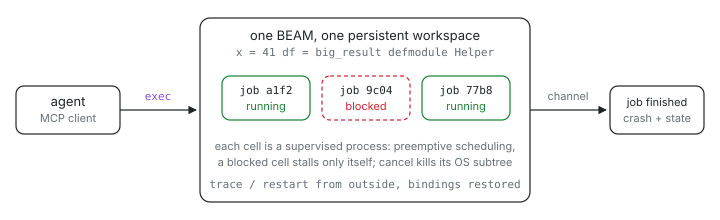

<p align="center">
  <picture>
    <source media="(prefers-color-scheme: dark)" srcset="assets/hero-dark.svg">
    
  </picture>
</p>

# ix-mcp-ex

What if a wedged cell could not freeze your agent's whole kernel? ix-mcp-ex is
an MCP server whose REPL **is Elixir**: one tool, `exec`, runs code
against a shared, persistent workspace of bindings, and every cell executes as
its own supervised BEAM process. The namespace survives across calls, jobs that
outlive a short budget keep running in the background, and no cell -- however
stuck -- can delay any other, because the scheduler preempts instead of
cooperating.

## Quickstart

```
nix run github:indexable-inc/index#mcp-ex        # MCP over stdio
```

From a clone (`git clone https://github.com/indexable-inc/index`):

```
nix run .#mcp-ex
```

Point an MCP client at that command and call `exec`.

## The main tool

`exec(code, budget \\ 15, intent)` evaluates `code` on the shared
workspace and waits up to `budget` seconds. Finished in time: you get output
and the rendered result. Still running: it continues as a background job and
you get a handle. Job control needs no extra tools, because the registry is
in-language -- the `Jobs` module is aliased in every cell:

```elixir
Jobs.tail("ab12", 20)      # last lines of a run's output
Jobs.grep("ab12", ~r/err/) # filter it
Jobs.await("ab12")         # block this cell (only this cell) until done
Jobs.result("ab12")        # the value, as a term
Jobs.cancel("ab12")        # kill it, and every OS process it spawned
Jobs.history()             # recent runs, grouped by session/topic
```

Bindings, aliases, and modules you define persist: you are building a session,
not running one-shot snippets. `Api.api("tail")` and `Api.help(Jobs, :tail)`
are the discovery surface, generated live from module docs.

## Tools

The MCP surface is exactly one tool; everything else the Python server
exposed as tools is an in-language callable, pre-aliased in every cell like
`Jobs` (the server instructions delivered at MCP initialize teach the same
list):

| tool | what it does |
|---|---|
| `exec` | run a cell; budget-then-background |

| in-cell callable | what it does |
|---|---|
| `Read.file(path, first \\ nil, last \\ nil)` | a file, optionally a 1-based line range |
| `Memory.remember(slug, desc, opts)` | durable memory facts in the weave store at `WEAVE_MEMORY_STORE`; `supersedes:`/`relates:` write typed edges for `Memory.graph/1`; recall rich rows via `Memory.recall/2` (regex), `Memory.semantic/2` (embedding similarity, a resident `weave recall --stdin`), or `Memory.query/1` (Datalog); `Memory.verify/2` records re-check receipts |
| `Ix.trace()` | stack dump of every job's processes, from outside |
| `Ix.restart()` | cancel jobs (sparing the calling cell), restart the workspace, restore bindings |
| `PrWatch.start(pr, cwd, interval \\ 15, timeout \\ 3600)` | watch a PR via `gh`, notify on merge/close/timeout |
| `Issues.pickup(3880)` | claim an issue atomically before working it (also `"owner/repo#n"`); a lost claim names the session that won |
| `Requests.post("review PR #42", body)` | offer any unit of work to every agent on the host (#3883); `Requests.pickup(id)` claims it atomically, `Requests.done(id)` finishes it, `Requests.list()` shows the board, open first |
| `Sessions.list()` | the session directory: every kernel instance on this host, with heartbeat liveness |
| `Sessions.send(id_or_name, text)` | message another session (`Sessions.broadcast/1` for all); arrives as a `source="sessions"` channel event within seconds |
| `Tui.act(uri, send_keys, peer \\ nil)` | drive a federated TUI resource via `ix-resource-cli` |

Because cells are separate BEAM processes, `Ix.trace/0` and `Ix.restart/0`
work from a fresh cell even while other jobs run or wedge -- the recovery
path that used to justify out-of-band tools needs none.

Every `tools/call` lands in a local SQLite action log
(`~/.local/state/ix-mcp-ex/actions.db`): a `sessions` row per server
instance (created lazily on first use), a `topics` row per topic (a
timeline -- repeated names make new rows), and an `actions` row per call
referencing both.

## Why we left Python

The predecessor ([`packages/mcp`](../mcp)) runs cells on one asyncio IPython
kernel. It works, and a lot of engineering keeps it working, all of it
compensating for the same four runtime facts:

1. **Cooperative scheduling.** One synchronous call -- a `subprocess.run`, a
   store flusher's blocking `put_blob` -- freezes the event loop, and with it
   every session's jobs and even the status probe you would use to diagnose
   it. The kernel's docs spend paragraphs teaching agents to wrap calls in
   `asyncio.to_thread` because one mistake stalls the fleet. On the BEAM,
   scheduling is preemptive and per-process: a cell that blocks forever costs
   one process, and the chaos test in this package proves the next job starts
   on time anyway.
2. **Silent task death.** An unobserved asyncio `Task` exception parks
   invisibly until something polls `.result()`. Here a crashed cell is a
   monitored process whose exit reason -- a crash report carrying the actual
   error and state -- is pushed to the client as a channel notification the
   moment it happens.
3. **Restart blast radius.** Restarting the shared Python kernel kills every
   session and fleet riding it, and tracing a wedged loop requires
   faulthandler signal hacks from outside. `Ix.trace()` here is
   `Process.info/2` on live processes; `Ix.restart()` is a supervisor
   restarting one process subtree while an ETS checkpoint hands the bindings
   straight back.
4. **No supervision.** Restart budgets, escalation, crash-with-state reports:
   hand-rolled or absent in the Python runtime. OTP gives all of it
   declaratively; this server's whole recovery story is its supervision tree.

The orchestration problems were Erlang-shaped all along. The rewrite does not
add machinery to get these guarantees; it deletes the machinery the old
runtime needed to approximate them.

### Where `nu()` went

Nowhere: it is deliberately gone, and nothing replaced it. The Python kernel
needed a blessed shell wrapper because Python subprocess ergonomics plus the
one-shared-event-loop hazard demanded a managed, non-blocking, cancellable
path for every external command. In a real language REPL on a preemptive
runtime that is redundant surface area: a cell that genuinely needs a
subprocess writes `System.cmd/3` (or opens a `Port`) itself, in-language, and
blocks nobody. The one behavior from that world that still matters survives
the cut: cancelling a job kills the OS process tree its cells spawned, so jobs
never leak orphans.

## Architecture

```
IxMcp.Supervisor (one_for_one)
├── IxMcp.ActionLog        SQLite action log: sessions / topics / actions
├── IxMcp.Session          this instance's session/topic ids + labels
├── IxMcp.Checkpoint       ETS keeper for workspace state (survives restarts)
├── IxMcp.Workspace        the shared binding + Macro.Env every cell sees
├── IxMcp.Jobs.Registry    id -> job process
├── IxMcp.Jobs.Supervisor  (DynamicSupervisor) one child per cell/job
│   └── IxMcp.Jobs.Job*    spawn_monitor's the evaluation, owns its output ETS
├── IxMcp.Jobs.History     ordered record of every run
├── IxMcp.MCP.Notifier     server-initiated notification fan-out
├── IxMcp.PrWatch.Supervisor (Task.Supervisor) one task per PR watch
├── IxMcp.IssueWatch       new-issue channel feed (stdio-gated, `gh search issues`)
├── IxMcp.SessionWatch     session heartbeat + message and request-feed delivery (stdio-gated)
└── IxMcp.MCP.Stdio        newline-delimited JSON-RPC on stdin/stdout
```

The evaluator copies the design of Livebook's `Livebook.Runtime.Evaluator`
(persistent binding + `Macro.Env` via `Code.eval_quoted_with_env/4` with
`:prune_binding`, per-cell output capture through a group-leader IO proxy)
rather than depending on Livebook, which is an application, not a library.
The group leader doubles as the job's process-tree tag: it is how tracing
finds a job's spawned processes and how cancellation finds the ports whose OS
process trees must die.

Cells are gated by the compiler: code that does not parse is rejected with the
compiler's diagnostic and never evaluated; warnings ride along in the result.
There are zero runtime dependencies -- OTP's own `JSON` module is the whole
wire format.

## Tests

```
mix test                          # local, includes the chaos suite
nix build .#mcp-ex.tests.elixir   # sandboxed gate: types, format, credo, tests
nix build .#mcp-ex.tests.smoke    # real stdio initialize/tools-list exchange
```

The chaos suite runs the motivating scenario live: a cell blocks forever,
other jobs keep running, `Ix.trace()` shows the wedged frame, restart
recovers the bindings, and no spawned OS process outlives its job.

## Credits

Written by Claude Code (an AI agent), operated by the ix team. Evaluator
design after [Livebook](https://github.com/livebook-dev/livebook)'s
`Livebook.Runtime.Evaluator`.
