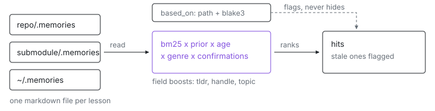

<p align="center">
  <picture>
    <source media="(prefers-color-scheme: dark)" srcset="assets/hero-dark.svg">
    
  </picture>
</p>

# memories

Ever fixed the same thing twice because the reason was in a chat log nobody
kept?

`memories` gives a repo a `.memories/` directory of one-lesson markdown files
and makes them findable: BM25 over the fields that matter, multiplied by how
confident the author was, how long since anyone confirmed it, and how many
times it has held up. A memory records the files it is based on by content
hash, so a lesson whose evidence moved comes back flagged instead of quietly
wrong.

## A memory

`<repo>/.memories/[<group>/]<slug>.md`. The file stem is the slug, never the
path, so a grouping subdirectory (one level, no deeper) keeps a big corpus under
the per-directory budget without changing any reference to it. `tldr` is the only
required field.

```markdown
---
tldr: An env var holding a store path makes every dependent rebuild; rank on sole count, not fan-out.
genre: memory            # memory | living | recipe | historical | frozen
topic: [nix, builds]
handle: [nix-dag, drvPath, sole-count]
prior: 0.8               # 0..1, written once at birth
based_on:
  - path: packages/nix-dag/src/rank.rs
    blake3: 41ab77c9e0
validated:
  - at: 2026-07-29T18:22:11Z
    by: claude-opus-5
    how: "nix-dag .#hil-compute-2; top sole-count node was IX_ASSETS_DIR"
    ok: true
scope: shared            # shared | user:<name>. default shared
---

Why, the evidence, the exact command.
```

There is no `always:` and no session-start injection: a memory reaches a model
because something searched for it. A key outside the set above is a lint error,
which is what stops `always:` coming back by habit.

## Use it

```sh
memories search "why did every host rebuild"      # ranked, refuted ones excluded
memories search rebuild --topic nix --limit 5 --all
memories roots                                    # the directories a search reads
memories show nix-rebuild-cascade
memories stale | memories refuted | memories unchecked --days 180
memories lint [--fix]

memories remember nix-rebuild-cascade \
  --tldr "An env var holding a store path makes every dependent rebuild" \
  --topic nix --handle nix-dag --prior 0.8 \
  --based-on packages/nix-dag/src/rank.rs \
  --scope shared < body.md

memories validate nix-rebuild-cascade --by claude-opus-5 --how "nix-dag .#hil-compute-2"
memories refute nix-rebuild-cascade --by claude-opus-5 --how "..." --instead new-slug
```

Every subcommand takes `--json` for the machine-readable contract and
repeatable `--dir <path>`, which replaces the default search roots entirely.
Exit codes: 0 fine, 1 a lint error or a slug that does not resolve, 2 a usage
error.

Every `search --json` carries the `roots` it read, and `memories roots` prints
the same set on its own. An empty result from a root set that quietly resolved to
one unexpected directory is indistinguishable from an empty result from the right
directories, and that is how a search tool stops working without anyone noticing.
A listed root may not exist on disk yet; it is still where the search looked.

## Where it looks

`.memories` of the git toplevel of the cwd, then of each enclosing git
toplevel (submodule before superproject), then `~/.memories`. A directory
listing, no manifest and no index to rebuild, so a file added by hand is
found on the next run.

## Ranking

```
score = bm25                                  # tldr 3.0, handle 3.0, topic 2.0, body 1.0
      * (0.5 + 0.5 * prior)
      * genre_factor                          # historical | frozen 0.5, else 1.0
      * max(0.3, exp(-age_days / 90))         # age since the newest validated.at
      * (1 + 0.15 * ln(1 + n_ok))             # confirmations, logarithmic
```

Every constant is a placed guess, not a measurement, and is meant to be tuned
once there are enough memories and a handful of queries with known answers
(`src/rank.rs`). A hit below `MIN_SCORE` is dropped rather than returned, so a
query with no good answer comes back empty and the caller can say so instead of
acting on the least-bad match. Ties break on slug, so `--limit 3` returns the
same three every run.

Two exclusion rules, deliberately different: a **refuted** memory (newest
`validated` says `ok: false`) is left out of `search` unless `--all`, while a
**stale** one (a `based_on` file no longer hashing to the recorded value) is
returned with `stale: true` and a reason naming the path. Reading a stale
memory unflagged is the harm; ranking it low would only hide the flag.

## Lint

Fourteen rules, all errors, each one a way a memory costs a later reader time:
`memory-frontmatter`, `memory-tldr`, `memory-body-budget`, `memory-slug`,
`memory-topic-unknown` (against an optional `topics.txt` in the directory),
`memory-related-unresolved`, `memory-duplicate-tldr`,
`memory-supersedes-unresolved`, `memory-based-on-missing`,
`memory-directory-budget` (per leaf directory), `memory-unchecked`,
`memory-stem-collision`, `memory-unknown-key`, `memory-secret`.

`memory-body-budget` and `memory-unchecked` apply to `genre: memory` only: a
reference page is supposed to be long, and a validation clock on one produces a
wall of errors that says nothing. That scoping is what replaces an `evergreen`
escape hatch, so there is no such field.

`memory-secret` is the rule with an incident behind it. It runs the fleet's own
redaction table (`packages/source/meta/src/sanitize.rs`) over every line, so a
credential pattern added there is caught here too. `validated.how` holds a
command line, which is exactly the shape that has leaked before, and unlike a
transcript a memory is committed on purpose.

A file that does not parse is a diagnostic with a line number, never a skip.
`--fix` only does the unambiguous part (sort `topic`/`handle`, refresh
`based_on` hashes, normalize whitespace) and refuses to touch a file whose
frontmatter does not parse.

## Install

```sh
nix run github:indexable-inc/index#memories -- --help
```

Or as a Rust binary from the monorepo:

```sh
cargo install --git https://github.com/indexable-inc/index memories
```

If you want the flake itself: `git clone https://github.com/indexable-inc/index`.

## Notes

The CLI is the only writer of the on-disk format: `remember`, `validate`,
`refute` and `lint --fix` edit the existing text rather than reserializing it,
so everything outside the lines they change comes back byte for byte. The
format and the JSON output are specified in `CONTRACT.md`, which the Elixir
wrapper (`IxMcp.Memories`) builds against too.
