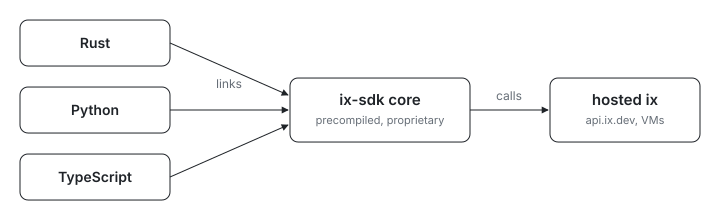

  <picture>
    <source media="(prefers-color-scheme: dark)" srcset="assets/hero-dark.svg">
    
  </picture>

# ix SDK

Building on ix and wondering which SDK to grab? Every binding links or bundles
the same precompiled, proprietary `ix-sdk` core, so behavior is identical
across languages. The bindings are built from ix's private crates and shipped
as artifacts; the published packages, not this tree, are the SDK.

| SDK | Get it |
| --- | --- |
| Rust | [`rust/`](./rust): wraps the prebuilt core via Nix; the other SDKs bind it |
| Python | the published `ix_sdk` wheel: PyPI, or pinned from R2 via `nix build .#ix-sdk-python` |
| TypeScript | `npm install @indexable/sdk` |

This repo carries no Python or TypeScript SDK source. In-repo,
[`packages/ix-sdk-python`](../ix-sdk-python) pins the published wheel by hash,
and [`rust/`](./rust) validates the prebuilt `ix-sdk-wire` artifact pins.

## License

Everything under `sdk/` is proprietary and source-available, governed by
[`sdk/LICENSE`](./LICENSE) (the Indexable SDK License), NOT the repository-root
MIT license. The SDK license supersedes the root MIT for this directory and its
subdirectories, including the compiled components the SDK fetches or bundles. In
short: you may use the SDK to build applications that access the hosted ix
service, but you may not reverse-engineer, modify, redistribute, or use it to
build a competing service. See `sdk/LICENSE` for the full terms.
