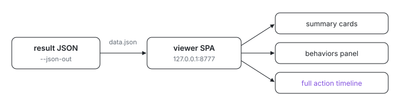

<p align="center">
  <picture>
    <source media="(prefers-color-scheme: dark)" srcset="assets/hero-dark.svg">
    
  </picture>
</p>

# system-prompt-eval-viewer

Got a system-prompt eval result JSON and want to actually read it? This is a
modern Svelte + Vite single-page app that renders one.

The harness that produced those reports lived here as
`packages/system-prompt-eval` and is gone (#4204): it drove live, billed
`claude -p` rollouts, and this repo does not spend against a paid API. The
viewer stays because it spends nothing and still reads any report already in
hand; `src/sample.json` is a committed example of the schema it renders.

```sh
nix run github:indexable-inc/index#system-prompt-eval-viewer -- /tmp/result.json

# no argument -> bundled sample
nix run github:indexable-inc/index#system-prompt-eval-viewer
```

The wrapper copies the built site to a temp dir, drops the JSON in as
`data.json` (which the app fetches on load), serves it on `127.0.0.1:8777`, and
opens a browser. You can also drag-and-drop any result JSON onto the page, or
use the **load JSON** button.

## What it shows

- summary cards per eval with the headline score and streak;
- a behaviors panel per eval: each behavior's name, full rubric, pass-rate bar,
  and a clickable pass/fail dot per rollout (jumps to that run);
- per rollout, the verdicts with the judge's evidence plus the **full action
  timeline**: every assistant message, thinking block, tool call with its
  input, tool result, and the final answer.

## Dev

In a clone (`git clone https://github.com/indexable-inc/index`):

```sh
cd packages/system-prompt-eval-viewer
npm install
npm run dev      # vite dev server
npm run build    # static bundle into dist/
```
